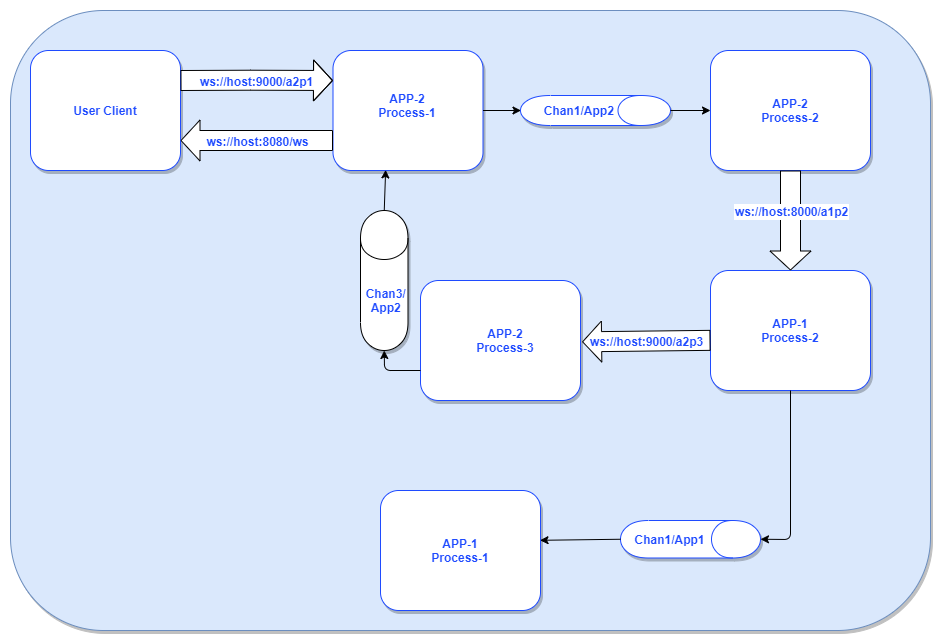

##### WebSocket





- Starting ServerApp2:
```bash
/go_websocket/cmd$ go run serverApp2.go 
2020/06/29 02:37:26 ServerApp2:: Starting Server at address: '127.0.0.1:9000'
2020/06/29 02:37:26 App2Process2:: Started reading from channel: Chan1/App2
2020/06/29 02:37:26 App2Process1:: Started reading from channel: Chan3/App2
```


- Starting ServerApp1:
```bash
/go_websocket/cmd$  go run invokeWsClient.go
go_websocket/cmd$ go run serverApp1.go 
2020/06/29 02:38:45 App1Process2:: Starting Server at address: '127.0.0.1:8000'
2020/06/29 02:38:45 App1Process1:: Started reading from channel: Chan1/App1

```

- Starting the User's Client and passing username and token as user input:
```bash
/go_websocket/cmd$ go run userClient.go 
Enter Username and Token separated by comma(,):
```

---
E.g.,:
- Keep `ServerApp1` and `ServerApp2` running.
- Start User's Client, and provide `Username` and `Token`, to stop press `Ctrl+c`:
```bash
go_websocket/cmd$ go run userClient.go 
Enter Username and Token separated by comma(,):
Rafael,123456
2020/06/29 02:48:20 Username: Rafael, token: 123456
2020/06/29 02:48:20 User::Sent message: {"type":1,"body":{"username":"Rafael","token":"123456"}} to: 127.0.0.1:9000/a2p1
ws://127.0.0.1:9000/a2p1
2020/06/29 02:48:20 User:: Received msg: {"topic":"topic1","message":{"bar":2,"baz":3,"foo":1}}
Enter Username and Token seperated by comma(,):

```

- Response from `ServerApp2`:
```bash
/go_websocket/cmd$ go run serverApp2.go 
2020/06/29 02:37:26 ServerApp2:: Starting Server at address: '127.0.0.1:9000'
2020/06/29 02:37:26 App2Process2:: Started reading from channel: Chan1/App2
2020/06/29 02:37:26 App2Process1:: Started reading from channel: Chan3/App2
2020/06/29 02:48:20 Pool:: Registered Client by ID: '40e17900-001d-4eb4-af39-0a7f8e962c3e', on server: 'ServerApp2P1'
2020/06/29 02:48:20 ServerApp2P1:: Received msg: {"type":1,"body":{"username":"Rafael","token":"123456"}}
2020/06/29 02:48:20 ServerApp2P1:: Sending msg: {"type":1,"body":{"token":"123456","username":"Rafael"}}, to target: Chan1/App2
2020/06/29 02:48:20 App2Process2:: Received message: {"type":1,"body":{"token":"123456","username":"Rafael"}}
ws://127.0.0.1:8000/a1p2
2020/06/29 02:48:20 Pool:: UnRegistered Client by ID: '40e17900-001d-4eb4-af39-0a7f8e962c3e' from server: 'ServerApp2P1'
2020/06/29 02:48:20 App2Process2:: Sending msg: {"type":1,"body":{"token":"123456","username":"Rafael"}}, to server `App1Process2`: 127.0.0.1:8000/a1p2
2020/06/29 02:48:20 Pool:: Registered Client by ID: '390689b2-dc23-4dd9-a058-3402751d6045', on server: 'ServerApp2P3'
2020/06/29 02:48:20 ServerApp2P3:: Received msg: {"type":1,"body":{"token":"123456","username":"Rafael"}}
2020/06/29 02:48:20 ServerApp2P3:: Sending msg: {"type":1,"body":{"token":"123456","username":"Rafael"}}, to target: Chan3/App2
2020/06/29 02:48:20 App2Process1:: Received message: {"type":1,"body":{"token":"123456","username":"Rafael"}}
ws://127.0.0.1:8080/ws
2020/06/29 02:48:20 Pool:: UnRegistered Client by ID: '390689b2-dc23-4dd9-a058-3402751d6045' from server: 'ServerApp2P3'
2020/06/29 02:48:20 App2Process1::Write msg to(User): 127.0.0.1:8080/ws

```

- Response from `ServerApp1`:
```bash
/go_websocket/cmd$ go run serverApp1.go 
2020/06/29 02:38:45 App1Process2:: Starting Server at address: '127.0.0.1:8000'
2020/06/29 02:38:45 App1Process1:: Started reading from channel: Chan1/App1
2020/06/29 02:48:20 Pool:: Registered Client by ID: '3969caac-1405-4e7e-9823-b76deebcc550', on server: 'App1Process2'
2020/06/29 02:48:20 App1Process2:: Received msg: {"type":1,"body":{"token":"123456","username":"Rafael"}}
2020/06/29 02:48:20 App1Process2:: Sending msg: {"type":1,"body":{"token":"123456","username":"Rafael"}}, to target: Chan1/App1
ws://127.0.0.1:9000/a2p3
2020/06/29 02:48:20 App1Process1:: Received message: {"type":1,"body":{"token":"123456","username":"Rafael"}}
2020/06/29 02:48:20 App1Process2:: Sending msg: {"type":1,"body":{"token":"123456","username":"Rafael"}}, to target: App2Process3
2020/06/29 02:48:20 Pool:: UnRegistered Client by ID: '3969caac-1405-4e7e-9823-b76deebcc550' from server: 'App1Process2'

```